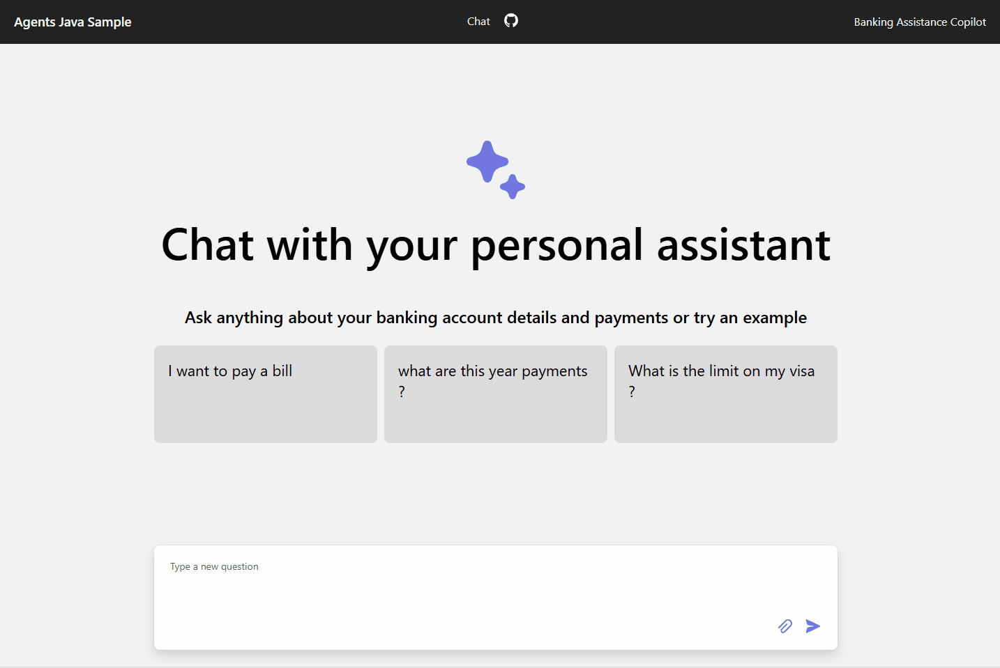
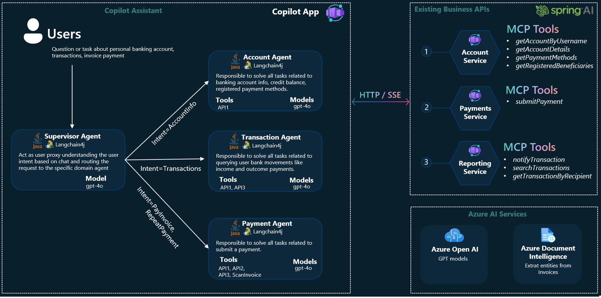

<div align="center">


# Multi-Agent Banking Assistant with Java & [Langchain4j]

[](https://codespaces.new/azure-samples/agent-openai-java-banking-assistant?hide_repo_select=true&ref=main&quickstart=true)
[](https://github.com/azure-samples/agent-openai-java-banking-assistant/actions)

[](LICENSE)

:star: If you like this project, give it a star on GitHub!

[Overview](#overview) • [Architecture](#architecture) • [Features](#features) • [Getting Started](#getting-started) • [Resources](#resources) • [FAQ](#faq) • [Contributing](#contributing)



</div>

---

## Authors
- [Mr. Vishal D. Chavare](https://www.linkedin.com/in/vishal-chavare/)  
- Mr. Shivam S. Pawar  
- Mr. Swapnil S. Ghodake  
- Mr. Onkar N. Kadam  

---

## Overview
The **Multi-Agent Banking Assistant** is a Java application emulating a personal AI-powered banking assistant.  
It allows users to:

- Inquire about account balances  
- Review recent transactions  
- Initiate payments using invoice data (OCR supported via Azure Document Intelligence)  

All services are exposed via REST APIs and consumed by agents using **Langchain4j**.  

This multi-agent design ensures scalable, secure, and conversational access to banking services.

---

## Features
- Vertical multi-agent system architecture (**Supervisor**, **Account**, **Transactions**, **Payments** agents)  
- Chat interface with React SPA and image upload support (invoices, receipts, bills)  
- Automatic invoice extraction and payment via Azure Document Intelligence  
- Integration of business APIs as MCP tools using [spring-ai-mcp](https://docs.spring.io/spring-ai/reference/api/mcp/mcp-overview.html)  
- Deployment on **Azure Container Apps** with automated resource provisioning via Azure Developer CLI  
- Supports **gpt-4o-mini** or **gpt-4o** models for AI agent reasoning  

---

## Architecture


**Components:**
- **Supervisor Agent**: Routes user requests to appropriate domain agent  
- **Account Agent**: Manages account details and payment methods  
- **Transactions Agent**: Handles transaction queries  
- **Payments Agent**: Extracts invoice data and initiates payment processing  
- **Backend APIs**: Exposed as REST & MCP tools to support agents  

---

## Getting Started

### Prerequisites
- [Java 17](https://learn.microsoft.com/en-us/java/openjdk/download#openjdk-17)  
- [Maven 3.8.x](https://maven.apache.org/download.cgi)  
- [Azure Developer CLI](https://aka.ms/azure-dev/install)  
- [Node.js](https://nodejs.org/en/download/)  
- [Git](https://git-scm.com/downloads)  
- PowerShell 7+ for Windows  

### Run Locally
```bash
# Clone repository
git clone https://github.com/azure-samples/agent-openai-java-banking-assistant.git
cd agent-openai-java-banking-assistant

# Start app locally (Windows)
cd app
./start-compose.ps1
# Or Linux/Mac
./start-compose.sh
